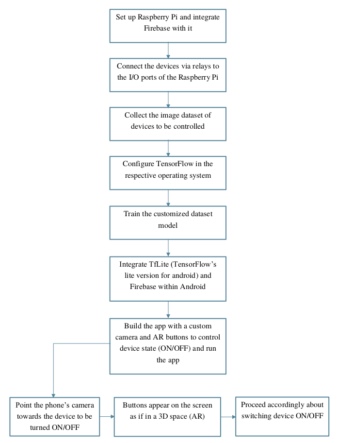

# Home Automation System using ML and IoT

1. The project aims at controlling home appliances with the help of an android app. The app
allows the user to control (switch ON/OFF) electrical appliances/devices just by
pointing the phone (camera) towards the appliance. 
2. The app will automatically detect what
type of object the phone is pointed to and will provide the functionality of switching the
object (appliance) ON/OFF.
3. Object detection is done using the Tensorflow library, which helps us to classify
different objects. We can rather create our own dataset and model it accordingly (The
second approach is much feasible).
4. In this project, the concept of Internet of Things (IoT) is fused with Machine Learning
to provide the user with utmost ease of controlling the devices connected to
Internet.

## Software and Hardware Requirements
1. [Android Studio](https://developer.android.com/studio)
2. Internet Connectivity
3. Microcontroller Board - Either [RPi](https://www.raspberrypi.org/) or [ESP8266](https://www.espressif.com/en/products/socs/esp8266/overview) or any other board with built-in wifi module.
4. Relays
5. Jumpers

## Getting Started and Learning Resources

1. Download the code and import it in android studio. Set up your firebase database and configure the app to use firebase database. Run the app using emulator or using real mobile.
2. Download/Write script for microcontroller. Use relays for electrical devices for testing. Run the script using `python <script_name>.py` 
3. [Installation and Setup of Operating System (Raspbian) - Raspberry Pi](https://www.youtube.com/watch?v=4z9trGhCbfk&list=PLQVvvaa0QuDesV8WWHLLXW_avmTzHmJLv&index=2)
4. [Remote Access with SSH and Remote Desktop - Raspberry Pi](https://www.youtube.com/watch?v=IDqQIDL3LKg&list=PLQVvvaa0QuDesV8WWHLLXW_avmTzHmJLv&index=3)
5. [GPIO Basics with LED light - Raspberry Pi](https://www.youtube.com/watch?v=WLo5Rgvj6qo&list=PLQVvvaa0QuDesV8WWHLLXW_avmTzHmJLv&index=6)
6. [Raspberry Pi and Firebase integration](https://medium.com/@dvd.ciri/raspberry-pi-firebase-home-automation-d5a237f18fb5)
7. [Android and Firebase integration](https://firebase.google.com/docs/android/setup)
8. [Tensorflow setup](https://www.tensorflow.org/install/pip)
9. [Tensorflow Lite with Android](https://codelabs.developers.google.com/codelabs/recognize-flowers-with-tensorflow-on-android/#0)

## Flowchart

